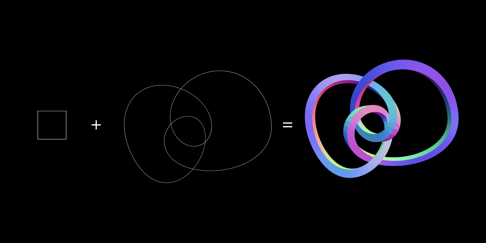

# geom-sweep



Extrudes a shape along a path.

## Usage

```javascript
var sweep = require('geom-sweep')
var g = sweep(path, shape, opts)
```

## API

### `sweep(path, shape, opts)`

- `path` - array of [x, y, z] positions defining the path to extrude along
- `shape` - array of [x, y, z] positions defining the swept shape
- `opts` - options
- `opts.radius` - extruded geometry radius (default 1)
- `opts.closed` - is the path closed? (default false)
- `opts.capse` - add caps at the end? (default false)
- `opts.closedShape` - is the shape path closed? (default true)

Returns new geometry: `{ positions: [], normals: [], uvs: [], cells: [] }`

## License

MIT, see [LICENSE.md](http://github.com/vorg/geom-sweep/blob/master/LICENSE.md) for details.
